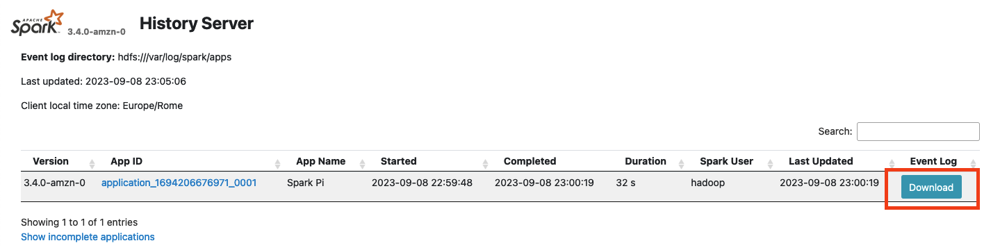

<div align="center">
  
  <h1>SprkLogs</h1>
  <p><strong>LLMs can't read your Spark logs. SprkLogs can.</strong></p>

  [](https://github.com/alexvalsechi/sprklogs/releases)
  [](https://www.electronjs.org/)
  [](https://www.python.org/)
  [](LICENSE)

  <p>
    <a href="https://alexvalsechi.github.io/sprklogs/">
      
    </a>
  </p>

  <p>
  <a href="https://github.com/alexvalsechi/sprklogs">
    
  </a>
</p>
</div>


---

Spark production logs can reach 1 GB. Sending that directly to an LLM blows up the context window or generates an absurd token bill. **SprkLogs processes the log locally first** — extracting and compressing only what matters — then sends a lean diagnostic report to the LLM of your choice.

You bring the ZIP. SprkLogs delivers the diagnosis.

---

## Demo

<div align="center">
  
  <br />
  <br />
  
</div>

---

## Quick Start

**Download the installer (Windows):**

1. Go to [Releases](https://github.com/alexvalsechi/sprklogs/releases)
2. Download `SprkLogs-setup-vX.X.X.exe`
3. Run the installer — no configuration required

**Or run from source:**

```bash
git clone https://github.com/alexvalsechi/sprklogs.git
cd sprklogs

# Backend
pip install -r backend/requirements.txt
python -m backend.app

# Desktop (separate terminal)
cd apps/desktop
npm install
npm start
```

---

## How it works

| Step | What happens |
|---|---|
| **1** | Drag a Spark event log ZIP (even 1 GB) into SprkLogs |
| **2** | The log is processed **locally** — nothing is uploaded to any cloud |
| **3** | A compressed diagnostic report is generated on your machine |
| **4** | Only the report is sent to the LLM (OpenAI, Gemini, or Anthropic) |
| **5** | You receive a full technical diagnosis: bottlenecks by stage, root cause, and actionable recommendations |

---

## Features

- Local ZIP processing — file size is no longer a limitation
- Multi-provider LLM support (OpenAI · Google Gemini · Anthropic)
- BYOK — bring your own API key, no subscription required
- Stage-by-stage breakdown table with sorting
- AI-generated diagnosis with bottlenecks, root cause, and recommendations
- Export analysis as Markdown report
- Analysis history stored locally
- Dark theme, bilingual interface (EN / PT)
- Privacy-first: no telemetry, no cloud storage, no account required

---

## Tech Stack

| Layer | Stack |
|---|---|
| Desktop | Electron 31, TypeScript |
| Renderer | HTML, CSS, vanilla JS |
| Backend | Python, FastAPI |
| Log processing | Python (local, in-process) |
| LLM providers | OpenAI, Google Gemini, Anthropic |
| Packaging | electron-builder, NSIS |
| Monorepo | Turborepo |

---

## License

<details>
<summary><strong>GPL-3.0</strong></summary>

```
This project is licensed under the GNU General Public License v3.0.

See the full license text in the LICENSE file.
```

</details>

---

<div align="center">
  Made by <a href="https://www.linkedin.com/in/alex-valsechi/">Alex Valsechi</a> &nbsp;·&nbsp; <a href="https://alexvalsechi.github.io/sprklogs/">sprklogs website</a>
</div>
