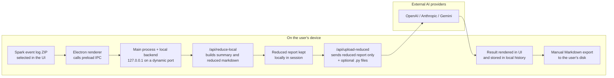

# 1. Architecture and Privacy Diagram

## Current desktop data flow

## What stays local

- The original ZIP file is read on the user's machine and is not sent to the AI provider.
- The first reduction pass runs locally in the FastAPI backend bundled with the Electron app.
- The reduced report remains available in the local session for rendering and export.
- UI history is stored in `localStorage`, capped at 10 recent analyses.

## What may leave the device

- Only the reduced text report is sent to the AI analysis step.
- `.py` files are optional and are forwarded only when the user attaches them.
- The API key typed in BYOK mode may be sent to authenticate requests to the selected provider.

## What is not part of the current primary flow

- No raw ZIP upload is used in the current desktop flow.
- There is no persistent server-side database for analysis history in this desktop experience.
- No mandatory login is required for the main local + BYOK workflow.
- Existing session handlers in Electron represent a lightweight local session only, not enterprise identity verification.

## Relevant privacy controls

- `contextIsolation: true`, `sandbox: true`, and `nodeIntegration: false` in the BrowserWindow.
- Narrow preload API surface for local reduction, report submission, session access, and export.
- Local backend bound to `127.0.0.1` on a per-run dynamic port.
- In-memory job store on the local backend, with polling-based retrieval rather than database persistence in the current flow.
