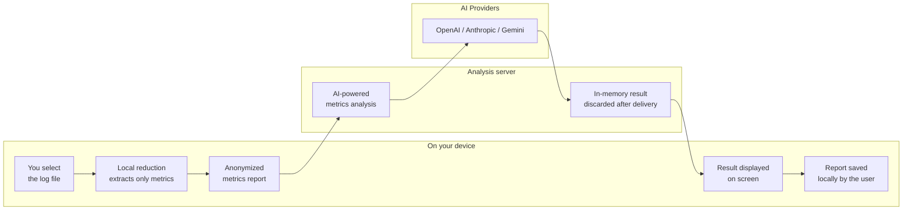

# 1. Architecture and Privacy Diagram

## How SprkLogs protects your data

## What happens with your data

**The original log never leaves your computer.**
Before any transmission, the system converts the log file into a compact performance metrics summary — no raw events, no business data, no client source code.

**What is sent to the analysis server:**
- Aggregated Spark metrics summary (execution times, memory usage, task counts)
- Job configuration files, if voluntarily provided by the user
- Language preference and which AI provider to use

**What is NOT stored:**
- The original log is never transmitted
- The server does not persist data after delivering the result
- There is no analysis history database on the server
- The report history is saved only locally, on the user's own device

**What the user controls:**
- The AI provider API key is provided by the user themselves
- The final report is saved only if the user chooses to do so
- Optional OAuth authentication stores only the access token, with an expiry date
