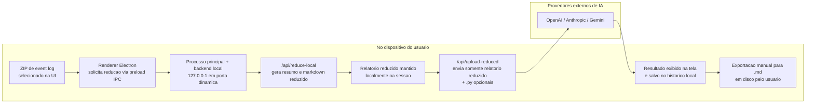

# 1. Diagrama de Arquitetura e Privacidade

## Fluxo atual do desktop

## O que permanece local

- O arquivo ZIP original e lido no computador do usuario e nao e enviado ao provedor de IA.
- A reducao inicial do log e executada localmente pelo backend FastAPI embarcado no app Electron.
- O relatorio reduzido fica disponivel na sessao local para renderizacao e download.
- O historico da interface fica em `localStorage`, limitado a 10 analises recentes.

## O que pode sair do dispositivo

- O backend local envia para analise apenas o relatorio reduzido em texto.
- Arquivos `.py` sao opcionais e so seguem para a analise quando o usuario os anexa.
- A chave de API digitada no campo BYOK pode ser enviada para autenticar a chamada ao provedor escolhido.

## O que nao faz parte do fluxo principal atual

- Nao ha upload do ZIP bruto para o backend de analise no fluxo desktop atual.
- Nao ha banco de dados persistente para historico de jobs nessa experiencia desktop.
- Nao ha login obrigatorio para usar a analise local + BYOK.
- Handlers de sessao existentes no Electron representam apenas sessao local simplificada e nao validacao de identidade corporativa.

## Controles relevantes de privacidade

- `contextIsolation: true`, `sandbox: true` e `nodeIntegration: false` no BrowserWindow.
- API do preload exposta de forma restrita para reducao local, envio do relatorio, sessao e exportacao.
- Backend local escutando em `127.0.0.1` com porta dinamica por execucao.
- Job store em memoria no backend local; os resultados sao consultados por polling e nao gravados em banco pelo fluxo atual.