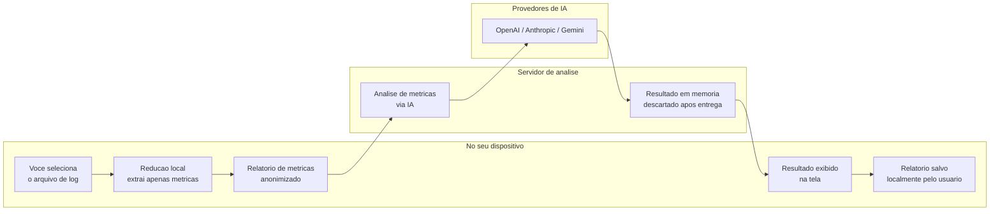

# 1. Diagrama de Arquitetura e Privacidade

## Como o SparkUI protege os seus dados

## O que acontece com os seus dados

**O log original nunca sai do seu computador.**
Antes de qualquer envio, o sistema converte o arquivo de log em um resumo compacto de metricas de desempenho — sem eventos raw, sem dados de negocio, sem codigo-fonte do cliente.

**O que e enviado ao servidor de analise:**
- Resumo de metricas agregadas do Spark (tempos de execucao, uso de memoria, contagem de tarefas)
- Arquivos de configuracao do job, se fornecidos voluntariamente pelo usuario
- Preferencia de idioma e qual provedor de IA utilizar

**O que nao e armazenado:**
- O log original nunca e transmitido
- O servidor nao persiste os dados apos entregar o resultado
- Nao existe banco de dados de historico de analises no servidor
- O historico de relatorios fica salvo apenas localmente, no proprio dispositivo do usuario

**O que o usuario controla:**
- A chave de API do provedor de IA e fornecida pelo proprio usuario
- O relatorio final e salvo somente se o usuario optar por isso
- A autenticacao OAuth opcional armazena somente o token de acesso, com prazo de validade